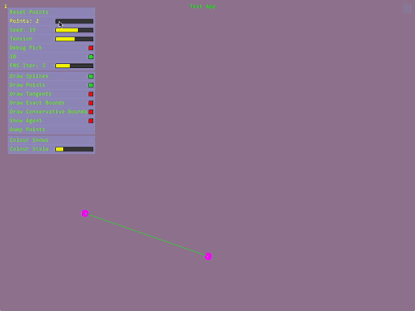
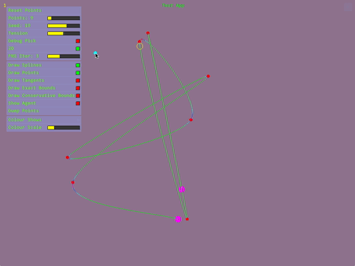
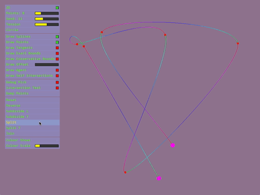

SplineLib
=========

Library for manipulating 2D and 3D splines. Functionality included:

* Creation from Bezier, Hermite, and Catmull-Rom forms
* Creation of an array of splines from an array of points and tension value,
  or Bezier hull points, or Hermite tangents.
* Creation of arcs and circles
* Evaluation of position, velocity, acceleration, curvature, and tangent frame
* Length measurement
* Finding bounds
* Offsetting (e.g., for stroking) and reversing splines
* Splitting and re-joining of single splines
* Subdivision of runs of splines either evenly, for flatness, or to be linear in
  arc length
* Finding the closest point on a run of splines
* Finding where runs of splines intersect, or a run of splines self-intersects
* Helpers for advancing a point along a spline at some given velocity

To build and run the test app:

    c++ --std=c++11 Splines.cpp SplinesTest.cpp -o splines && ./splines

Or add those files to your favourite IDE.

Examples
--------

Splines from Points:

Fast and Conservative Bounds:

Closest Point on Spline:

Spline Intersections:

Moving Points on Splines:

Subdivision and Joining:

